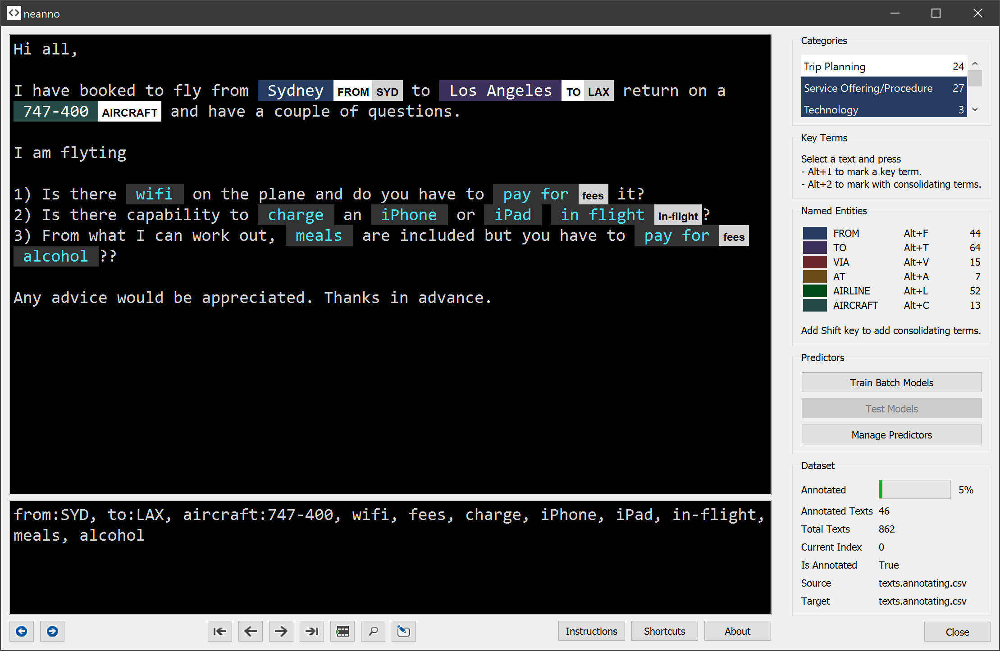

# neanno

**neanno is a tool for annotating texts.**



## Installation
To install, clone this repo and ensure all packages from requirements.txt are installed in your environment.

```
git clone https://github.com/timoklimmer/neanno.git
cd neanno
conda create -n neanno python=3.6
conda activate neanno
pip install -r requirements.txt
python neanno.py
```

(You need Anaconda or Miniconda installed to get the commands above working.)


## Usage
Once installed, you can run neanno by activating your neanno environment and running the `neanno.py` script in the directory where it resides.

```
conda activate neanno
python neanno.py
```

Before you can use neanno, you have to write a project file. Alternatively, you can use one of the sample project files.

**For more details see the documentation notebook [here](documentation/neanno-getting-started.ipynb).**

## Disclaimer
As always - feel free to use but don't blame me if things go wrong.